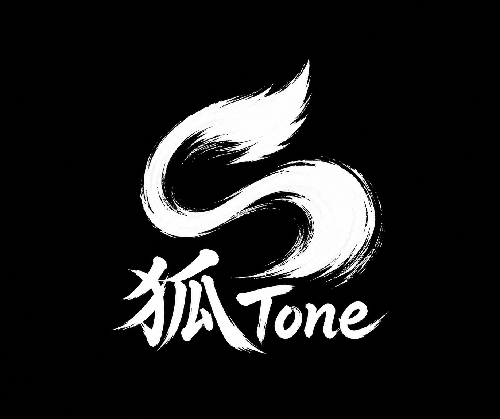

# 狐Tone (KitsuneTone)

<p align="center">
  
</p>

狐Toneは、[LMMS](https://github.com/LMMS/lmms)を基盤として独自機能を追加した、Windows向けのオリジナルDAWです。正式版2.3.0ではVST3専用ホスト、共通プラグイン画面、ARA 2連携、MIDI・音声録音、タイムストレッチ、オートメーション、日本語UI、ソングエディター型のパターン編集、安定性強化に加え、多機能エフェクトプラグイン「EffeTune Mixwright」(Frieve作、MITライセンス)を標準搭載しています。

> [!IMPORTANT]
> 狐ToneはLMMS公式版ではなく、LMMS開発チームによる承認・サポートを受けた製品でもありません。狐Tone固有の問題はLMMS本家ではなく、このリポジトリのIssuesへ報告してください。

## ダウンロード

[GitHub Releases](https://github.com/SakiikaVR/KituneTone-DAW/releases/latest)からWindows 64-bit正式版をダウンロードできます。

- インストーラ版: スタートメニュー、アンインストール、狐Toneプロジェクトの関連付けに対応
- ポータブル版: 任意のフォルダーへ展開して `KitsuneTone.exe` を実行

対応OSはWindows 10およびWindows 11です。VST3プラグインはWindows標準のVST3フォルダーと、アプリ内の `VST3` フォルダーから検出します。

## 説明書

導入から各画面、トラック編集、VST3、録音、ピッチベンド、オートメーション、アルペジオ、ミキサー、ARA、入出力、ショートカットまでの操作は、[狐Tone 2.3.0 全機能説明書](docs/USER_MANUAL.md)を参照してください。

## 狐Tone専用プロジェクト形式

狐Tone 2.1以降はLMMS形式から分離した専用形式を使用します。

| 拡張子 | 用途 |
| --- | --- |
| `.ktpz` | 圧縮プロジェクト（標準） |
| `.ktp` | 非圧縮プロジェクト |
| `.ktt` | プロジェクトテンプレート |

XMLルート要素は `kitsunetone-project`、作成元は `KitsuneTone` として保存されます。LMMSの `.mmp`、`.mmpz`、`.mpt` は開けません。また、非VST3エフェクトの読み込み互換機能もありません。

2.2.0ではパターンの内部形式を、固定スロットから独立タイムラインへ刷新しました。2.1.x以前のプロジェクトとのパターン互換はなく、2.2.0以降で新規作成したプロジェクトを使用します。

## 主な機能

- VST3インスツルメント／エフェクト専用のネイティブホスティング
- GUI、パラメーター、MIDI、トラック、アルペジオ／コード、エフェクトをまとめた共通画面
- VST3パラメーターのオートメーション、状態保存、右クリック接続
- ノート、ベロシティ、パン、複雑なピッチベンドのMIDI録音・再生
- マルチトラック音声録音と録音入力デバイスの個別選択
- ARA 2対応プラグイン向けの音声ソース、再生領域、テンポ・拍子連携
- ピッチを保つ25～400%のタイムストレッチ
- MIDI入出力、トラック間MIDIルーティング、BPM同期アルペジエーター
- 音声／MIDIファイルのドラッグ＆ドロップ、MIDI入出力、音声・ステム書き出し
- ソングエディターと共通のタイムライン操作を備えたパターンエディター
- パターン内の複数MIDI／サンプル／オートメーションクリップと明示的小節数設定
- 常時最大表示のトラックエディター、クリップの複数選択・複製・分割
- ミキサー、エフェクトチェーン、コントローラーラック、プロジェクトノート
- 多機能エフェクトプラグイン「EffeTune Mixwright」を標準搭載(下記参照)
- Noto Sans／Noto Sans JP、日本語UI、アクセントカラーテーマ

## 内蔵エフェクト: EffeTune Mixwright

[EffeTune Mixwright](https://github.com/Frieve-A/effetune-mixwright)(Frieve作、MITライセンス)をVST3エフェクトとして同梱しています。エフェクトチェインの「追加」から選択すると、1つのプラグイン画面の中で下記71種のエフェクト・ツールを自由に組み合わせてチェインを構築できます。

ホスト機能: 最大8チャンネル入出力、5系統のバス処理パイプライン、A/B状態比較、1×／2×／4×／8×オーバーサンプリング、Room EQ測定データのインポート

| カテゴリ | 内容 |
| --- | --- |
| アナライザー(5種) | レベルメーター、オシロスコープ、スペクトログラム、スペクトラムアナライザー、ステレオメーター |
| 基本(8種) | チャンネルディバイダー、DCオフセット、マトリクス、マルチチャンネルパネル、ミュート、極性反転、ステレオバランス、ボリューム |
| ディレイ(2種) | ディレイ、タイムアライメント |
| ダイナミクス(10種) | オートレベラー、ブリックウォールリミッター、コンプレッサー、エキスパンダー、ゲート、マルチバンドコンプレッサー、マルチバンドエキスパンダー、マルチバンドトランジェント、パワーアンプ電源サグ、トランジェントシェイパー |
| EQ(14種) | 15バンドグラフィックEQ、15バンドパラメトリックEQ、5バンドダイナミックEQ、5バンドパラメトリックEQ、バンドパスフィルター、コムフィルター、イヤホンケーブルシミュレーター、ハイパスフィルター、ローパスフィルター、ラウドネスイコライザー、ナローレンジ、ルームEQ、ティルトEQ、トーンコントロール |
| ローファイ(8種) | ビットクラッシャー、デジタルエラーエミュレーター、DSD64混変調シミュレーター、ハムノイズ生成、ノイズブレンダー、ジッター、レコードノイズ、レコード再生シミュレーター |
| モジュレーション(4種) | ドップラー歪み、ピッチシフター、トレモロ、ワウフラッター |
| その他(1種) | オシレーター |
| レゾネーター(3種) | ホーンレゾネーター、ホーンレゾネーター+、モーダルレゾネーター |
| リバーブ(4種) | プレートリバーブ、FDNリバーブ、IRリバーブ、RSリバーブ |
| サチュレーション(7種) | ダイナミックサチュレーション、エキサイター、ハードクリッピング、倍音歪み、マルチバンドサチュレーション、サチュレーション、サブシンセ |
| 空間系(4種) | クロスフィードフィルター、MSマトリクス、マルチバンドバランス、ステレオブレンド |
| 制御(1種) | セクション |

## ソースからのビルド

主なビルド環境:

- Visual Studio 2022
- Qt 6.8.x (`msvc2022_64`)
- vcpkg
- CMake / Ninja

```bat
vcpkg install --triplet x64-windows

cmake -S . -B build -G Ninja ^
  -DCMAKE_BUILD_TYPE=RelWithDebInfo ^
  -DFORCE_VERSION=2.3.0 ^
  -DWANT_QT6=ON -DWANT_SDL=ON -DWANT_JACK=OFF ^
  -DCMAKE_PREFIX_PATH=C:/Qt/6.8.3/msvc2022_64 ^
  -DCMAKE_TOOLCHAIN_FILE=C:/vcpkg/scripts/buildsystems/vcpkg.cmake ^
  -DVCPKG_TARGET_TRIPLET=x64-windows

cmake --build build
```

ビルド後の実行ファイルは `build/KitsuneTone.exe` です。Windows配布物は `packaging/windows/build-release.ps1` で生成します。

## ライセンスと帰属

狐ToneはLMMSから派生したGPLソフトウェアです。LMMS由来のコードと狐Toneで加えた変更は、各ファイルに別の記載がない限り、[GNU General Public License version 2 or later](LICENSE.txt)（GPL-2.0-or-later）の条件で利用・再配布できます。

バイナリを再配布する場合は、対応する完全なソースコード、ビルドに必要な情報、ライセンス表示をGPLが定める方法で受領者へ提供してください。LMMSの著作権表示と貢献者への帰属は保持しています。

主な第三者コンポーネント:

| コンポーネント | ライセンス | 用途 |
| --- | --- | --- |
| [LMMS](https://github.com/LMMS/lmms) | GPL-2.0-or-later | 狐Toneの基盤 |
| [Steinberg VST 3 Plug-In SDK](https://github.com/steinbergmedia/vst3sdk) | MIT | VST3ホスティング |
| [ARA SDK](https://github.com/Celemony/ARA_SDK) | Apache-2.0 | ARA連携 |
| Noto Sans / Noto Sans JP | SIL Open Font License 1.1 | UIフォント |

LMMS本来のREADMEは [README.upstream.md](README.upstream.md) に保存しています。各第三者コンポーネントのライセンスとNOTICEも、対応するソースディレクトリおよび配布物の `licenses` フォルダーに保持しています。
